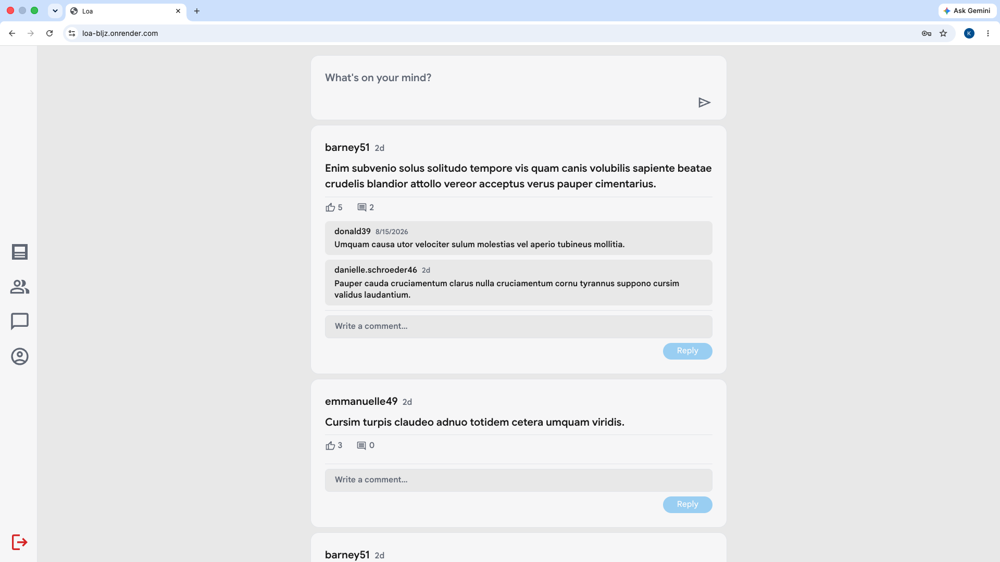
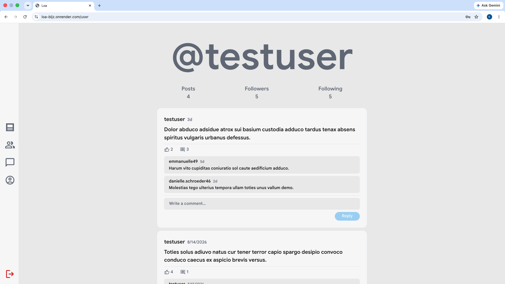
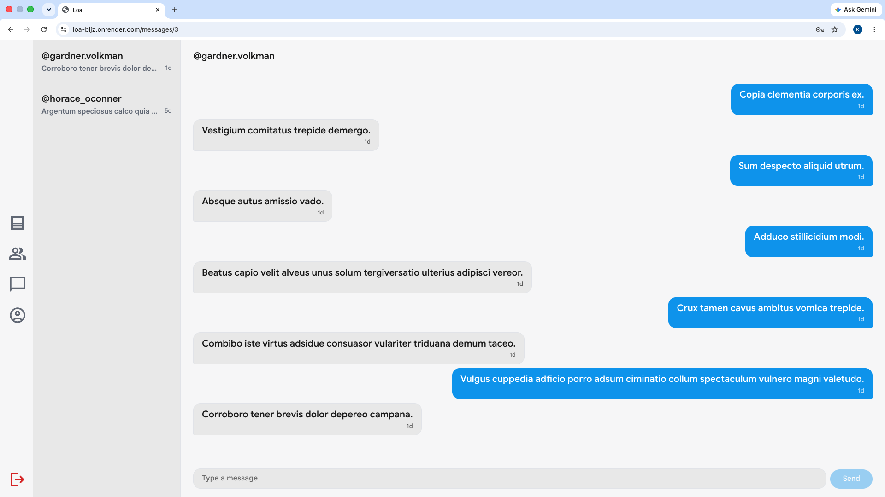

# Loa

A full-stack social media app with real-time messaging — built as a portfolio project covering authentication, a relational data model, and WebSocket-based live chat.

**Live demo:** https://loa-bljz.onrender.com

> Note: hosted on Render's free tier — the server may take up to a minute to wake up on first visit.

Try it without signing up: username `testuser`, password `password123`.

## Features

- Session-based authentication (signup, login, protected routes) with Passport.js
- Posts, likes, and comments
- Follow system — a profile's posts are only visible to people who follow them
- A searchable directory of users
- Real-time 1-on-1 messaging, powered by Socket.IO — messages appear instantly without a refresh
- Light/dark theme, following system preference

## Stack

- **Frontend:** React (Vite), CSS Modules, React Router
- **Backend:** Express, Passport.js, Socket.IO
- **Database:** PostgreSQL + Prisma
- **Deployment:** Render (serving both the API and the built frontend)

## Screenshots

| Feed | Profile | Messaging |
|---|---|---|
|  |  |  |

## Local development

1. Clone the repo, run `npm install` at the root, in `frontend/`, and in `server/`.
2. Copy `server/.env.example` to `server/.env` and fill in `DATABASE_URL` and `SESSION_SECRET`.
3. Create a local Postgres database, then run `cd server && npx prisma migrate dev`.
4. (Optional) Seed sample data: `node server/prisma/seed.js`.
5. From the project root: `npm run dev`.
